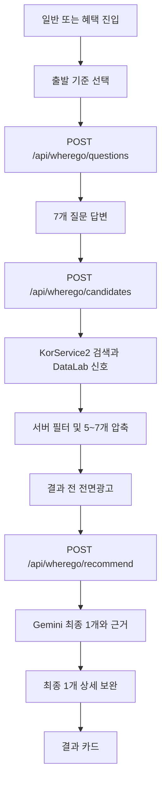

# 구조와 흐름

최종 갱신: 2026-07-15 KST

## 저장소 경계

```text
wherego/
  pages/index.tsx              일반 진입
  pages/promotion.tsx          혜택 진입
  src/WheregoApp.tsx           공용 UI와 상태 흐름
  src/api/wheregoApi.ts        JBG API 클라이언트
  src/promotion/               프로모션 SDK와 중복 방지
  src/config.ts                공개 가능한 운영 ID

jbg/apps/server/backend/
  app/interfaces/http/routes/wherego.py
  app/resources/wherego/       질문과 선택지 단일 원본
  scripts/wherego_qc_report.py
  tests/test_wherego*.py
```

클라이언트에는 관광공사·Gemini·mTLS 비밀값을 두지 않는다.

## 전체 요청 흐름



## 질문 생성

`POST /api/wherego/questions`는 출발지와 세션을 받아 다음을 만든다.

- 원천축 3개에서 각 1개
- 핵심 일반 테마 3개에서 각 1개
- 재미 테마 1개에서 1개
- 한 세트 내부 질문·테마 중복 제거
- 모든 선택지를 검색 태그, 힌트, 제약, 관광공사 분류에 연결

클라이언트 fallback 질문은행은 없다. 서버 질문이 잘못되면 출발 화면에서 재시도한다.

## 후보 준비

`POST /api/wherego/candidates`는 Gemini를 사용하지 않는다.

1. 답변 메타데이터를 검색 의도와 제약으로 정규화한다.
2. 지역 코드, 키워드, 콘텐츠 유형을 사용해 KorService2를 제한된 횟수로 병렬 호출한다.
3. 좌표·주소·기간·거리·지역·반려동물 등 하드 제약을 적용한다.
4. 동일 장소의 하위 시설을 군집화하고 의도별 과대표집을 줄인다.
5. DataLab 지역 방문자수 신호를 붙인다.
6. 점수 창과 다양성 규칙으로 5~7개를 반환한다.

명시 지역 `strict`는 질문 JSON의 허용 법정동 코드와 주소 prefix를 사용해 검색과 Gemini 전 후보를 모두 제한한다. 지역 묶음을 Python에 하드코딩하지 않는다.

## Gemini 최종 선택

`POST /api/wherego/recommend`는 준비된 candidate set과 답변 메타데이터를 받는다.

- 모델: `gemini-3.1-flash-lite`
- 역할: 후보 중 최종 1개 선택, 성향 요약과 짧은 추천 근거 생성
- 계획 생성이나 관광공사 검색은 하지 않는다.
- 구조화 JSON, 짧은 출력, 최소 thinking을 사용한다.
- Gemini 실패 시 규칙 fallback 여부를 응답 source와 QC에 기록한다.

후보 메타데이터에 제목, 위치, 좌표, 사용 가능한 Type1 이미지가 모두 있으면 상세 호출을 생략한다. 부족할 때만 최종 1개에 `detailCommon2`를 제한 시간으로 호출한다. `detailIntro2`와 기본 `detailImage2`는 사용하지 않는다.

## 사용량과 광고

후보 준비 시 크레딧을 예약하고 성공 시 확정한다. 추천 실패는 환불하며 미완료 예약은 만료 처리한다. 세션 ID와 보상 ID는 멱등 처리한다.

- 무료·광고·공유 크레딧: 후보 준비 후 결과 전 전면광고
- 유료 크레딧: 결과 전 전면광고 생략
- Gemini: 전면광고 `show`/`impression` 이후 시작
- 광고 종료 후 미완료: AI 분석 화면 유지

## 인앱결제와 로그인

상품 정보는 Apps in Toss IAP SDK에서 조회한다. 사용자가 구매 버튼을 눌렀을 때만 Toss 로그인을 요청한다.

1. 클라이언트가 로그인 authorization code를 서버에 전달한다.
2. 서버가 짧은 앱 세션과 안정적인 Toss 사용자 키를 관리한다.
3. 결제 후 서버가 mTLS 주문 상태를 검증한다.
4. 주문 ID를 멱등 키로 +10을 한 번 지급한다.
5. pending 주문은 재실행 시 복원하고 환불 주문은 회수한다.

## 프로모션 안전 경계

혜택 진입의 결과 화면만 프로모션을 실행한다.

1. 세션 ref 확인
2. 프로모션 코드별 로컬 Storage 확인
3. 서버 `/api/wherego/promotion/attempt` 원자적 예약
4. 예약 성공 뒤 `grantPromotionReward` 호출

서버 guard 장애는 fail-closed다. SDK promise rejection은 Toss 도달 여부가 불명확하므로 guard를 유지하고 자동 재시도하지 않는다. 명확히 지급되지 않은 구조화 오류만 guard를 해제한다.

## 캐시와 관측

- KTO 검색, 상세, DataLab 응답은 서버 메모리 캐시를 사용한다.
- 정확한 좌표와 원시 사용자 답변은 QC 저장 대상이 아니다.
- QC는 질문 구성, 후보 수, Gemini fallback, 이미지·지도, 거리·지역 위반, 지연, 추천 집중도를 집계한다.
- 현재 캐시 시간과 호출 제한은 JBG `apps/server/env/prod.example`을 기준으로 한다.
