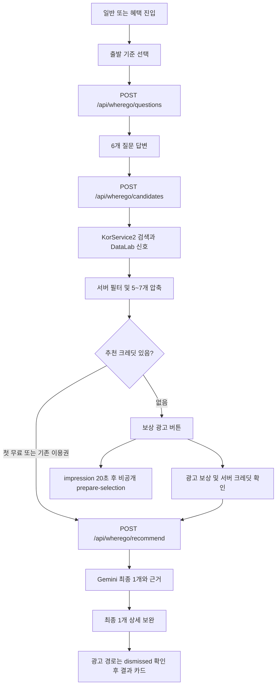

# 구조와 흐름

최종 갱신: 2026-10-01 KST

## 저장소 경계

```text
wherego/
  pages/index.tsx              일반 진입
  pages/promotion.tsx          혜택 진입
  src/WheregoApp.tsx           공용 UI와 상태 흐름
  src/api/wheregoApi.ts        JBG API 클라이언트
  src/promotion/               프로모션 서버 지급과 로컬 중복 방지
  src/ads/recommendationAdGate.ts 광고 노출·보상·종료 경계
  src/discovery/               공개 장소 공유와 찜
  src/analytics/               SDK 계측 실패 보호
  src/review/                  성공 결과 횟수와 1회 리뷰 요청 상태
  src/config.ts                공개 가능한 운영 ID
  web/                        공개 웹 진입 HTML
  public/web/                 AI 없는 웹 추천·장소·글 소스
  web-server/                 식별자 없는 웹 이벤트 수집

jbg/apps/server/backend/
  app/interfaces/http/routes/wherego.py
  app/infrastructure/wherego_preparation.py 비공개 AI 준비와 단일 실행
  app/resources/wherego/       질문과 선택지 단일 원본
  scripts/wherego_qc_report.py
  tests/test_wherego*.py
```

클라이언트에는 관광공사·Gemini·mTLS 비밀값을 두지 않는다.

## 전체 요청 흐름


```mermaid
flowchart TD
  A["일반 또는 혜택 진입"] --> B["출발 기준 선택"]
  B --> C["POST /api/wherego/questions"]
  C --> D["6개 질문 답변"]
  D --> E["POST /api/wherego/candidates"]
  E --> F["KorService2 검색과 DataLab 신호"]
  F --> G["서버 필터 및 5~7개 압축"]
  G --> H{"추천 크레딧 있음?"}
  H -->|첫 무료 또는 기존 이용권| I["POST /api/wherego/recommend"]
  H -->|없음| R["보상 광고 버튼"]
  R --> P["impression 20초 후 비공개 prepare-selection"]
  R --> W["광고 보상 및 서버 크레딧 확인"]
  W --> I
  I --> J["Gemini 최종 1개와 근거"]
  J --> K["최종 1개 상세 보완"]
  K --> L["광고 경로는 dismissed 확인 후 결과 카드"]
```

크레딧이 없을 때 후보 요청은 `previewOnly: true`로 예약하지 않는다. 위 기본 흐름 외에 공유 크레딧은 기존 결과 전 광고 정책을 유지한다. 준비 ACK 자체는 결과 접근 권한이 아니다.

## 질문 생성

`POST /api/wherego/questions`는 출발지와 세션을 받아 다음을 만든다.

- 원천축 3개에서 각 1개
- 핵심 일반 테마 3개에서 각 1개
- 새 앱은 `questionCount: 6`으로 요청하며 추가 재미 문항을 붙이지 않음. 이전 앱의 기본 7문항 계약은 호환용으로 유지
- 한 세트 내부 질문·테마 중복 제거
- 모든 선택지를 검색 태그, 힌트, 제약, 관광공사 분류에 연결

클라이언트 fallback 질문은행은 없다. 서버 질문이 잘못되면 출발 화면에서 재시도한다.

## 후보 준비

`POST /api/wherego/candidates`는 Gemini를 사용하지 않는다.

1. 답변 메타데이터를 검색 의도와 제약으로 정규화한다.
2. 지역 코드, 키워드, 콘텐츠 유형을 사용해 KorService2를 제한된 횟수로 병렬 호출한다.
3. 좌표·주소·기간 유효성과 명시적 필수 거리·지역·반려동물 조건을 적용한다. 거리·혼잡도·분위기 소프트 선호와 구분한다.
4. 동일 장소의 하위 시설을 군집화하고 의도별 과대표집을 줄인다.
5. DataLab 지역 방문자수 신호를 붙인다.
6. 점수 창과 다양성 규칙으로 5~7개를 반환한다.

압축 후보가 0개인 경우에도 추천 요청은 Gemini로 진행한다. Gemini는 `direct` 장소 한 곳을 제안하고 서버가 관광공사 정확 일치 검색과 기존 거리·지역·반려동물 제약을 다시 적용한다.

명시 지역 `strict`는 질문 JSON의 허용 법정동 코드와 주소 prefix를 사용해 검색과 Gemini 전 후보를 모두 제한한다. 지역 묶음을 Python에 하드코딩하지 않는다.

## Gemini 최종 선택

`POST /api/wherego/recommend`는 준비된 candidate set과 답변 메타데이터를 받는다.

- 모델: `gemini-3.1-flash-lite`
- 역할: 후보 중 최종 1개 선택, 성향 요약과 짧은 추천 근거 생성. 후보가 없거나 primary 목적 후보가 없으면 직접 장소 제안
- Gemini가 관광공사 API를 직접 호출하지는 않는다. 서버가 direct 장소명을 관광공사에서 재조회하고 검증한다.
- 구조화 JSON, 짧은 출력, 최소 thinking을 사용한다.
- Gemini 실패 시 규칙 fallback 여부를 응답 source와 QC에 기록한다.

후보 메타데이터에 제목, 위치, 좌표, 사용 가능한 Type1 이미지가 모두 있으면 상세 호출을 생략한다. 부족할 때만 최종 1개에 `detailCommon2`를 제한 시간으로 호출하고, 수정 가능한 이미지가 여전히 없으면 `detailImage2`를 1회 조회해 `Type1` 이미지만 선택한다. `detailIntro2`는 사용하지 않는다.

## 사용량과 광고

일반 후보 준비 시 크레딧을 예약하고 성공 시 확정한다. 광고 경로의 후보 미리보기는 예약·차감·환불하지 않으며 실제 보상 후 정식 추천에서 예약한다. 추천 실패는 환불하며 미완료 예약은 만료 처리한다. 세션 ID와 보상 ID는 멱등 처리한다.

- KST 매일 첫 무료·기존 유료 크레딧: 전면·배너 광고 생략
- 광고 보상 완료마다 +1, 일일 보상 횟수 상한 없음. 같은 크레딧에 두 번째 전면광고 없음
- 공유 +3은 하루 1회이며 기존 결과 전 광고 정책 유지
- 보상 광고의 SDK `impression` 후 20초에 비공개 AI 선택 준비. 빠른 보상은 타이머 취소 후 서버 지급 직후 정식 추천
- 비공개 준비는 결과·크레딧을 반환하지 않는다. 동일 세션 캐시는 10분 프로세스 로컬이고 동시 준비·세션별 예산이 제한된다. 제한되면 보상 후 정상 추천
- AI 시작 전 종료/실패/이탈은 타이머 취소. 시작 후 중도 종료에는 비용 발생 가능. 결과는 SDK 보상·서버 지급·광고 종료 후에만 표시
- 광고 종료 후 미완료: AI 분석 화면 유지
- 후보 없음: 동일 조건 재시도 대신 출발지를 유지한 새 질문 세트, 이미 확인한 광고 권한 유지

## 초기 화면과 리뷰

- 앱 시작 시 추천 횟수·저장 로그인 조회를 전용 로딩 화면에서 완료한다. IAP 상품 조회와 새 로그인은 실행하지 않고 유효한 저장 세션의 기존 주문 복원만 뒤에서 수행한다.
- 인트로는 초기 조회의 중간값을 노출하지 않고 한 번에 표시한다.
- 성공 결과를 세션당 한 번 집계하고 누적 2회 이상일 때 리뷰 CTA를 한 번만 표시한다.

## 인앱결제와 로그인

신규 상품 조회·구매·로그인 UI를 제거했다. 기존 유료 잔여와 유효한 저장 로그인 세션은 유지한다. 서버는 mTLS로 기존 주문을 검증하고 주문 ID 기준 한 번만 지급하며 pending 복원과 환불 회수를 처리한다. 기존 API와 SKU를 삭제하거나 신규 판매를 다시 활성화하지 않는다.

## 프로모션 안전 경계

혜택 진입의 결과 화면만 프로모션을 실행한다.

1. 세션 ref와 프로모션 코드별 로컬 Storage 확인
2. 서버 `/api/wherego/promotion/grant` 호출
3. DB에서 사용자 hash+프로모션 코드 원자적 예약
4. Apps in Toss 식별키 검증 API 호출
5. 지급 key 발급 후 mTLS 서버 지급
6. 성공 시 DB와 로컬 guard 확정

검증이나 지급 key 발급 전 실패는 예약을 해제한다. 실제 지급 요청의 네트워크 결과가 불명확하면 중복 위험 때문에 guard를 유지하고 자동 재시도하지 않는다. `/api/wherego/promotion/attempt`는 이전 출시 AIT 호환용이다.

## 캐시와 관측

- KTO 검색, 상세, DataLab 응답은 서버 메모리 캐시를 사용한다.
- 같은 세션의 비공개 AI 선택은 단일 실행/10분 캐시를 사용한다. 재시작·만료·다중 인스턴스에서는 재호출될 수 있다. 모든 답변 조합의 최종 결과 사전 저장은 아니다.
- 공개 웹은 미니앱과 분리된 브라우저 규칙 추천이며 AI를 호출하지 않는다. 웹 이벤트는 식별자·답변·정밀 위치 없이 발생 횟수만 집계한다.
- 정확한 좌표와 원시 사용자 답변은 QC 저장 대상이 아니다.
- QC는 질문 구성, 후보 수, Gemini fallback, 이미지·지도, 거리·지역 위반, 지연, 추천 집중도를 집계한다.
- 현재 캐시 시간과 호출 제한은 JBG `apps/server/env/prod.example`을 기준으로 한다.
